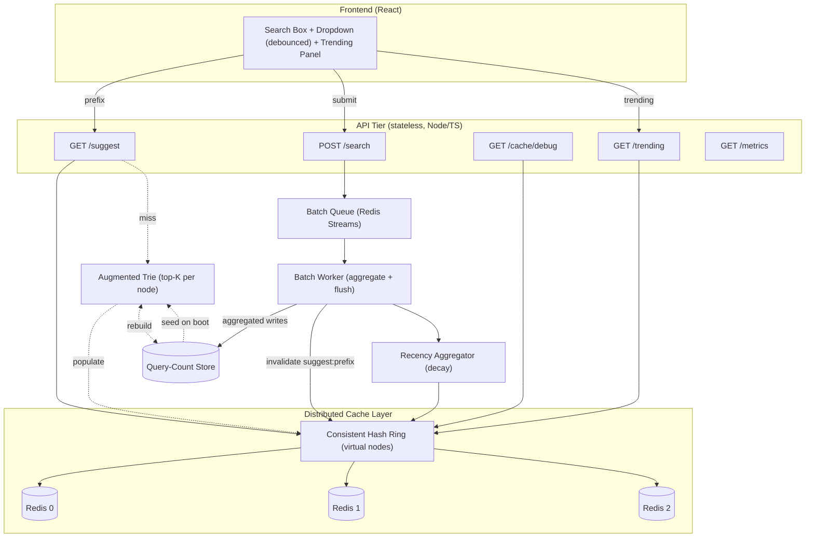

# Product Requirements Document (PRD)
## Search Typeahead System

| | |
|---|---|
| **Project** | Search Typeahead System (Google-style autocomplete) |
| **Course** | HLD — Trimester 8 |
| **Status** | Phase 2 — Implementation (architecture frozen) |
| **Backend** | Node.js + TypeScript (Fastify + ioredis) |
| **Frontend** | React (Vite) |
| **Cache** | 3+ Redis containers, consistent hashing + virtual nodes |
| **Queue** | Redis Streams (consumer groups) |
| **Last updated** | 2026-06-21 |

---

## 1. Problem Statement

Build a working search typeahead system that:

1. Suggests up to **10 popular queries** as the user types, sorted by popularity.
2. Provides a **UI** for searching and viewing suggestions.
3. Exposes a **dummy search API** (`POST /search → {"message":"Searched"}`) that records the query.
4. Updates **query-count data** on every search.
5. Serves suggestions from a **distributed cache** using **consistent hashing**.
6. Supports **trending searches** (recency-aware ranking).
7. Supports **batch writes** to reduce write pressure.

The focus is **backend data-system design**: how counts are stored, how suggestions are served fast,
how the cache is distributed, and how write pressure is reduced.

---

## 2. Design Philosophy

The central engineering insight driving this design:

> **A prefix's suggestions are just a precomputed top-K cache keyed by that prefix.**
> `prefix → top-K queries` is a key-value lookup, not a live tree traversal.

This makes the **read path O(1)** (a single cache GET). The consequence is that the system is both
**read-heavy** (every keystroke is a read) and **write-heavy** (every search updates counts and could
update many prefix entries). The naive write cost is enormous:

```
1 search  → 1 count update  +  ~L prefix top-K updates   (L = query length)
1M searches/sec × ~11 writes each ≈ 11M writes/sec
```

No database is optimized for both heavy reads and heavy writes simultaneously, so the design's job is
to **reduce writes** while keeping reads O(1). We do this with:

- **Batching** — update derived suggestion data only every N counts (eventual consistency, **no data loss**).
- **Sampling** (optional lever) — process only a fraction of searches (data loss, but trends preserved).
- **Eventual consistency** — accepted as an NFR; it is what makes batching/sampling legal.

---

## 3. Project Goals

### 3.1 Primary Goals
- Serve prefix suggestions with **sub-50ms p99** end-to-end latency via a precomputed top-K cache.
- Maintain query popularity reliably with **batched, write-reduced** updates to the primary store.
- Distribute the cache across multiple nodes using **consistent hashing with virtual nodes**.
- Provide a clean **debounced UI** with a suggestions dropdown and a trending panel.

### 3.2 Secondary Goals
- **Trending / recency** ranking via exponential decay so spikes are rewarded then fade.
- **Observability**: a metrics endpoint proving cache-hit ratio and write reduction.
- **Demonstrable failure handling** for cache-node loss, queue loss, and worker crash.

### 3.3 Success Criteria
| Criterion | Target |
|---|---|
| Suggestion latency (cache hit), p99 (server-side) | < 10 ms |
| End-to-end typeahead latency, p99 | < 50 ms |
| Cache hit ratio (steady state) | ≥ 90% |
| Write reduction via batching | ≥ 100× on suggestion-update writes |
| Dataset loaded | ≥ 100,000 queries |
| All required APIs functional | 100% |
| Trending rewards recency and decays spikes | demonstrable |

---

## 4. Functional Requirements

| ID | Requirement | Detail |
|---|---|---|
| FR-1 | Search suggestions | Return up to 10 suggestions for a prefix. |
| FR-2 | Prefix matching | All suggestions `startsWith(normalizedPrefix)`. |
| FR-3 | Sorting | Ordered by ranking score (count, or blended trending score) descending. |
| FR-4 | Search submission | `POST /search` returns `{"message":"Searched"}` and enqueues the query. |
| FR-5 | Query count updates | Existing → increment; new → insert with count = 1 (+ dataset seed). |
| FR-6 | Trending searches | Maintain recent-activity signal; `GET /trending`; blend into ranking. |
| FR-7 | Distributed cache | Suggestions cached per prefix across N Redis nodes. |
| FR-8 | Consistent hashing | Prefix key → node via hash ring with virtual nodes. |
| FR-9 | Batch writes | Searches buffered, aggregated by query, flushed by size or interval. |
| FR-10 | Cache invalidation | On rank change, invalidate `suggest:<prefix>`; TTL backstops staleness. |
| FR-11 | Metrics | Expose hits, misses, DB reads/writes, queue depth, latencies, write-reduction. |
| FR-12 | Cache debug | `GET /cache/debug?prefix=` returns owning node + hit/miss + ring info. |
| FR-13 | Input normalization | Trim, lowercase, collapse internal whitespace before matching. |
| FR-14 | Frontend | Debounced input, dropdown, keyboard nav, trending section, submit-on-enter. |

---

## 5. Non-Functional Requirements

| ID | NFR | Target / Statement |
|---|---|---|
| NFR-1 | Latency | Cache-hit suggest p99 < 10ms server; e2e < 50ms. |
| NFR-2 | Scalability | Horizontally scalable cache (add nodes → ~1/N rehash). Stateless API tier. |
| NFR-3 | Reliability | Frequency counts are durable (queue-backed). Suggestions may be stale. |
| NFR-4 | Throughput | Reasons to 1M searches/s, 10M reads/s; batching keeps writes ~1.01M/s. |
| NFR-5 | Availability | Cache-node loss degrades to cache-miss (rebuild), not outage. |
| NFR-6 | Consistency | **Eventual consistency** for suggestions/trending (explicitly accepted). |
| NFR-7 | Maintainability | Modular folders, documented, tested. |
| NFR-8 | Observability | Metrics endpoint + structured logs for the performance report. |

---

## 6. API Specification

### 6.1 `GET /suggest`
- **Query params:** `q` (string, required, 0–100 chars), `limit` (int, optional, default 10, max 10).
- **200 Response:**
```json
{
  "prefix": "iph",
  "suggestions": [
    { "query": "iphone", "count": 100000, "score": 100000 },
    { "query": "iphone 15", "count": 85000, "score": 85000 }
  ],
  "source": "cache",
  "node": "cache-node-2",
  "latencyMs": 1.8
}
```
- **Status:** `200` OK (incl. empty `suggestions: []` for no-match/empty prefix); `400` invalid params.
- **Validation:** normalize (trim, lowercase, collapse whitespace); clamp `limit` to 1–10.
- **Edge cases:** empty `q` → `[]`; whitespace-only → `[]`; no matches → `[]`; mixed case → matched; over-long prefix → truncated to 100 chars.

### 6.2 `POST /search`
- **Body:** `{ "query": "iphone 15" }`
- **200 Response:** `{ "message": "Searched" }`
- **Status:** `200` enqueued; `400` missing/empty query.
- **Validation:** non-empty after trim, ≤ 200 chars.
- **Edge cases:** duplicate rapid submits → aggregated; queue down → still `200` to user, error counted in metrics (we never fail the user's search for a counting concern).

### 6.3 `GET /cache/debug`
- **Query params:** `prefix` (required).
- **200 Response:**
```json
{
  "prefix": "iph",
  "normalizedKey": "suggest:iph",
  "owningNode": "cache-node-2",
  "virtualNodeHit": "cache-node-2#37",
  "status": "hit",
  "ttlRemainingMs": 41200,
  "ringPosition": 2847193021
}
```
- **Status:** `200`; `400` missing prefix.
- **Purpose:** demonstrate consistent-hashing routing and hit/miss.

### 6.4 `GET /trending`
- **Query params:** `limit` (int, optional, default 10).
- **200 Response:** top-N queries by blended trending score (shows `totalCount` and `recentScore`).
- **Edge cases:** cold start → falls back to overall popularity.

### 6.5 `GET /metrics` and `GET /healthz`
- `/metrics` → counters & histograms (§10). `/healthz` → liveness `{ "status": "ok" }`.

---

## 7. Dataset Design

- **Format:** CSV (or NDJSON) — `query,count`.
- **Required fields:** `query` (string), `count` (integer).
- **Derived at load:** `recentCount` (starts 0), `lastUpdated` (load time).
- **Source plan:** an open dataset (e.g. AOL search logs, Kaggle popular-queries, or Wikipedia titles + pageviews). If counts are absent, aggregate duplicates or assign Zipf-distributed synthetic counts. Target ≥ 100,000 rows. A generator script produces a compliant synthetic dataset when no external file is supplied.

---

## 8. Data Models

```
Query        { query: string (PK), count: number, recentCount: number, lastUpdated: number }
TrieNode     { children: Map<char, TrieNode>, isWord: boolean, count: number, topSuggestions: Suggestion[] }
Suggestion   { query: string, count: number, score: number }
BatchEntry   { query: string, delta: number, firstSeen: number, lastSeen: number }
TrendingScore{ query, totalCount, recentScore, blendedScore }
```

Cache keyspace:
| Key | Value | TTL |
|---|---|---|
| `suggest:<prefix>` | `Suggestion[]` | ~60s |
| `trending` | `Suggestion[]` | ~30s |
| `query:<query>` | `{count, recentCount}` | ~300s (optional) |

---

## 9. Edge Cases

| Case | Handling |
|---|---|
| Empty input (`q=""`) | `200`, `suggestions: []`. |
| Missing input (no `q`) | `400`. |
| Mixed case | Normalize to lowercase. |
| Leading/trailing spaces | Trim; collapse internal whitespace. |
| No matches | `200`, `[]`. |
| Duplicate queries | Aggregated as one `BatchEntry`. |
| Cache miss | Fall back to Trie, compute, populate, return. |
| Cache node failure | Ring reroutes to next node → miss → rebuild; health-check evicts dead node. |
| Queue failure | `POST /search` still `200`; error counted; counts may be slightly under-recorded (NFR-6). |
| Worker crash | Redis Streams pending list → re-read on restart; at-least-once. |
| Partial writes | Ack only after durable write; replay pending; derived data rebuildable. |
| Process restart | Stateless API; Trie rebuilt from store on boot; cache repopulates lazily. |

---

## 10. Metrics

| Metric | Type | Why |
|---|---|---|
| `cache_hits_total` | counter | hit ratio numerator |
| `cache_misses_total` | counter | hit ratio denominator |
| `db_reads_total` | counter | fallback frequency |
| `db_writes_total` | counter | proves write reduction |
| `queue_depth` | gauge | backpressure visibility |
| `batch_flushes_total` / `batch_size_avg` | counter/gauge | batching effectiveness |
| `search_latency_ms` | histogram | p50/p95/p99 |
| `trending_update_latency_ms` | histogram | trending recompute cost |
| `writes_avoided_total` (derived) | counter | headline write-reduction number |

### 10.1 Performance Targets
| Metric | Target |
|---|---|
| `/suggest` p50 (cache hit) | < 2 ms |
| `/suggest` p95 | < 6 ms |
| `/suggest` p99 | < 10 ms |
| Cache hit ratio | ≥ 90% |
| Write reduction | ≥ 100× (target ~1000× with batch threshold 1000) |
| Trie build (100k entries) | < 30 s |

---

## 11. Architecture Overview (HLD)



### 11.1 Key Flows
- **Suggest:** normalize → ring → cache GET → (hit) return / (miss) Trie top-K → populate cache → return.
- **Search:** return `Searched` immediately → enqueue → worker aggregates → write counts → invalidate affected prefixes → feed trending.
- **Trending:** events → decay aggregator → blended score → rebuild top-N → trending cache → `/trending`.
- **Cache:** `hash(key)` → walk ring clockwise → vnode → physical node → hit/miss.

---

## 12. Key Design Decisions (LLD summary)

| Area | Decision | Why |
|---|---|---|
| Storage | Augmented Trie + lightweight count store + Redis cache | O(1) reads, satisfies distributed-cache rubric, fewest dependencies. |
| Trie | Node stores `children, isWord, count, topSuggestions` | Precomputed top-K → no subtree DFS on read (O(L+K) miss path). |
| Cache | `suggest:<prefix>` TTL ~60s + active invalidation | Self-heals on missed invalidation; satisfies "no stale forever". |
| Hashing | MurmurHash3, ~150 vnodes/node | Even load; add/remove rehashes only ~1/N keys. |
| Queue | Redis Streams (consumer groups) | Durable, replay on crash, no new infra (already running Redis). |
| Ranking | `α·norm(totalCount) + (1−α)·norm(recentScore)`, recentScore via decay | α=1 → basic mode; α≈0.7 → trending; decay fades spikes. |
| Cross-process consistency | Worker **write-throughs** fresh top-K + trending into the shared cache | API and worker are separate processes with separate Tries; the shared Redis cache is the cross-process serving surface, so the API serves fresh results without owning the live counts. |

### 12.1 Two-Process Write-Through (important for the viva)

The API server and the batch worker are **separate processes**, each with its own in-memory
Trie. When a live search updates counts, it does so in the *worker's* Trie. If the worker only
*invalidated* `suggest:<prefix>`, the API would simply refill that key from its own **stale** Trie
(which never saw the live search), and the update would never appear.

The fix: on every flush, the worker **recomputes the affected top-K and writes it through** into the
distributed cache (and likewise publishes the `trending` list). The shared Redis cache thus becomes
the **single cross-process source of truth for served suggestions**. The API serves whatever the
cache holds; the worker keeps the cache fresh. This is consistent with the core philosophy that
suggestions are a derived cache — we simply make the *writer* own cache freshness instead of the
reader. (At very large scale the writer would also persist counts to a shared store so any API
replica could rebuild on cold start; in this single-host demo the dataset baseline + cache suffice.)

---

## 13. Assumptions

1. Demo runs on one host; distributed cache = N real Redis containers.
2. Eventual consistency for suggestions/trending is acceptable.
3. The count store is the source of truth; cache and Trie top-K are derived and rebuildable.
4. At-least-once queue semantics; rare double-counts tolerable.
5. Dataset counts are the historical baseline; live searches add on top.
6. We reason to 1M req/s but measure at demo-feasible scale for the performance report.
7. Stack: Node.js + TypeScript backend, React frontend, Redis cache+queue.

---

## 14. Risks & Future Scope

**Risks:** Trie top-K maintenance cost on live updates (mitigated by batching + capped precompute depth);
at-least-once double-counting (mitigated by processed offsets); single-host "distributed" optics (mitigated
by real Redis containers + `/cache/debug`); normalization edge cases (single shared normalizer); trending
scale tuning (config-driven α + pure-count fallback).

**Future scope:** sampling lever; geo/user personalization; typo tolerance (edit distance / Norvig);
compressed/radix Trie + first-char sharding; Trie snapshotting for instant cold start.

---

## 15. Grading Alignment

| Rubric component | Marks | Where satisfied |
|---|---|---|
| Basic implementation | 60 | Dataset loader, React UI, `/suggest`, `/search`, count updates, distributed Redis cache + consistent hashing. |
| Trending searches | 20 | Decay-based `recentScore` blended into ranking; `/trending`; documented windowing/decay. |
| Batch writes | 20 | Redis Streams + batch worker, write-reduction metrics, failure-handling discussion. |
